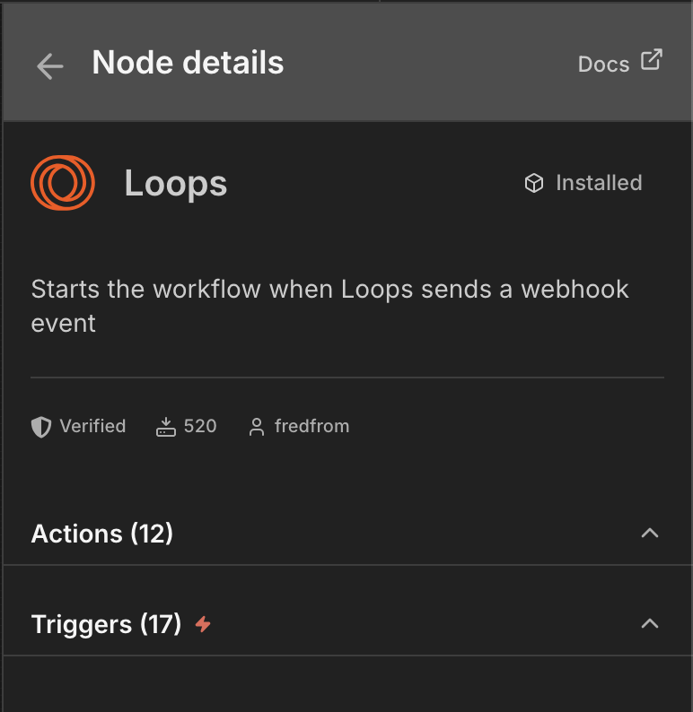

# n8n-nodes-loops

[](https://www.npmjs.com/package/n8n-nodes-loops)
[](https://www.npmjs.com/package/n8n-nodes-loops)
[](https://www.npmjs.com/package/n8n-nodes-loops)
[](LICENSE)

This is an n8n community node for [Loops](https://loops.so) — the email platform for modern SaaS. It lets you manage contacts, send events, deliver transactional emails, and receive webhooks directly from your n8n workflows.

[n8n](https://n8n.io/) is a [fair-code licensed](https://docs.n8n.io/reference/license/) workflow automation platform.



[Installation](#installation) · [Operations](#operations) · [Credentials](#credentials) · [Compatibility](#compatibility) · [Resources](#resources)

## Installation

Follow the [installation guide](https://docs.n8n.io/integrations/community-nodes/installation/) in the n8n community nodes documentation.

**npm package name:** `n8n-nodes-loops`

### Self-hosted

1. Go to **Settings > Community Nodes**
2. Select **Install**
3. Enter `n8n-nodes-loops` and confirm

### Docker

Mount your custom nodes directory into the container:

```yaml
volumes:
  - ~/.n8n:/home/node/.n8n
```

Then install the package inside `~/.n8n/nodes/`:

```bash
cd ~/.n8n/nodes
npm install n8n-nodes-loops
```

Restart n8n to load the new nodes.

## Operations

### Loops (Action Node)

| Resource | Operation | Description |
|---|---|---|
| **API Key** | Test | Validate that the API key is valid |
| **Contact** | Create | Create a new contact |
| **Contact** | Delete | Delete a contact by email or user ID |
| **Contact** | Find | Find a contact by email or user ID |
| **Contact** | Update | Update an existing contact |
| **Contact Property** | Create | Create a custom contact property |
| **Contact Property** | List | List all contact properties |
| **Dedicated Sending IP** | List | Retrieve dedicated sending IP addresses |
| **Event** | Send | Send an event with properties and mailing list updates |
| **Mailing List** | List | List all mailing lists |
| **Transactional Email** | List | List published transactional email templates |
| **Transactional Email** | Send | Send a transactional email with variables and attachments |

### Loops Trigger (Webhook Node)

Starts workflows when Loops sends webhook events. Supports all 17 event types:

- **Contact events:** created, deleted, unsubscribed, mailing list subscribed/unsubscribed
- **Email send events:** campaign sent, loop sent, transactional sent
- **Email delivery events:** delivered, soft bounced, hard bounced
- **Email engagement events:** opened, clicked, unsubscribed, resubscribed, spam reported
- **Test event:** for verifying webhook configuration

The trigger includes HMAC-SHA256 signature verification with replay attack protection.

## Credentials

### Loops API

Used by the **Loops** action node.

1. Log into [Loops](https://app.loops.so)
2. Go to **Settings > API**
3. Copy your API key
4. In n8n, create a new **Loops API** credential and paste the key

### Loops Webhook API

Used by the **Loops Trigger** node.

1. In your Loops dashboard, go to **Settings > Webhooks**
2. Add your n8n webhook URL (shown in the trigger node's **Webhook URLs** section)
3. Enable the events you want to receive
4. Copy the **Signing Secret**
5. In n8n, create a new **Loops Webhook API** credential and paste the signing secret

The signing secret is optional but recommended for production use. Without it, signature verification is skipped.

## Example Workflows

### New signup: create contact and send event

1. **Webhook** node receives a signup payload
2. **Loops** node — Contact > Create (email, firstName, lastName)
3. **Loops** node — Event > Send (eventName: `signup`, email)

### Stripe cancellation: update contact for win-back

1. **Stripe Trigger** node fires on `customer.subscription.deleted`
2. **Loops** node — Contact > Update (email, subscribed: false)
3. Loops triggers a win-back automation based on the contact update

## Rate Limits

The Loops API allows 10 requests per second. The node surfaces 429 errors with a clear message. Use n8n's retry-on-failure setting to handle bursts.

## Compatibility

- **Minimum n8n version:** 1.0.0
- **Tested with:** n8n 1.91.3 (Docker)
- Works with n8n Cloud, self-hosted, and Docker deployments

## Resources

- [n8n Community Nodes Documentation](https://docs.n8n.io/integrations/community-nodes/)
- [Loops API Reference](https://loops.so/docs/api-reference)
- [Loops Webhooks Documentation](https://loops.so/docs/webhooks)

## License

[MIT](LICENSE)
